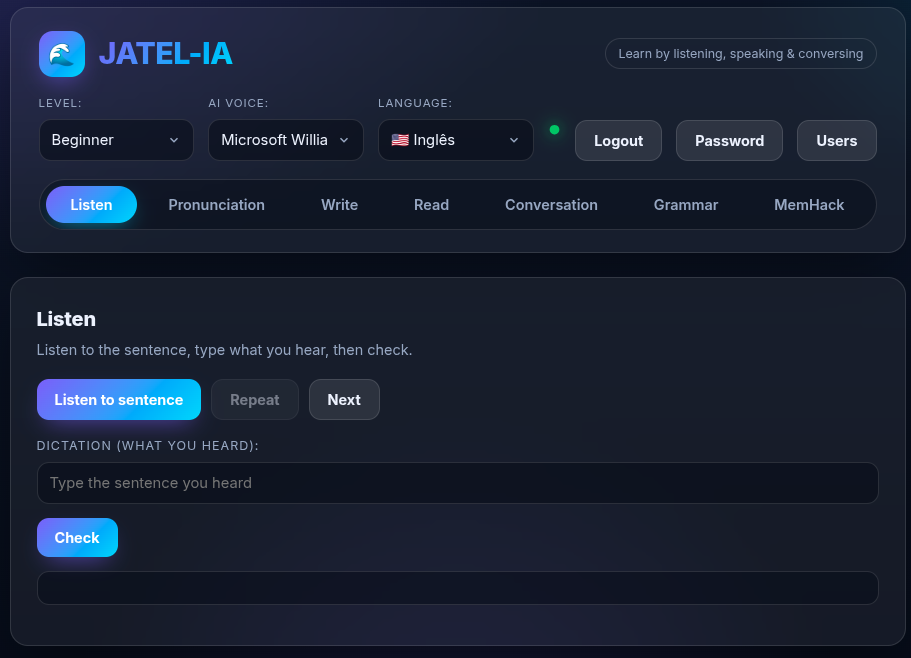
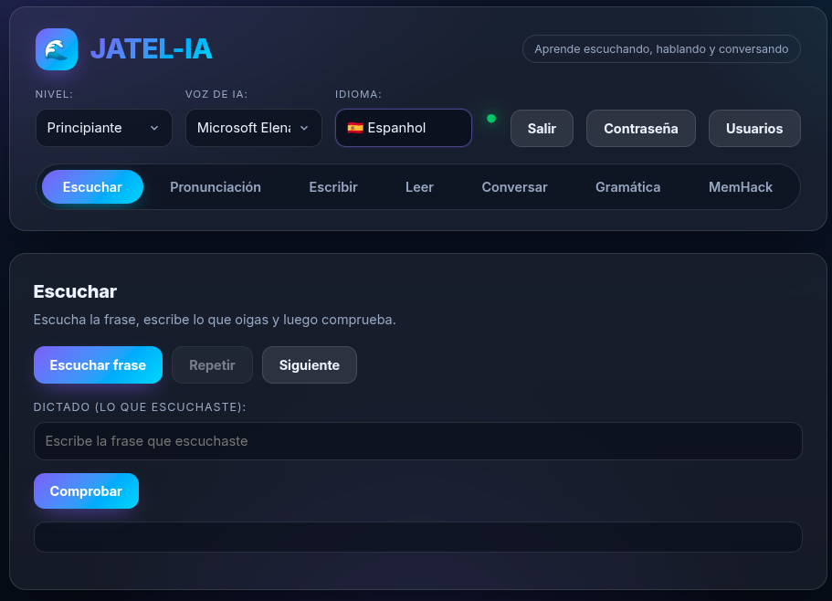
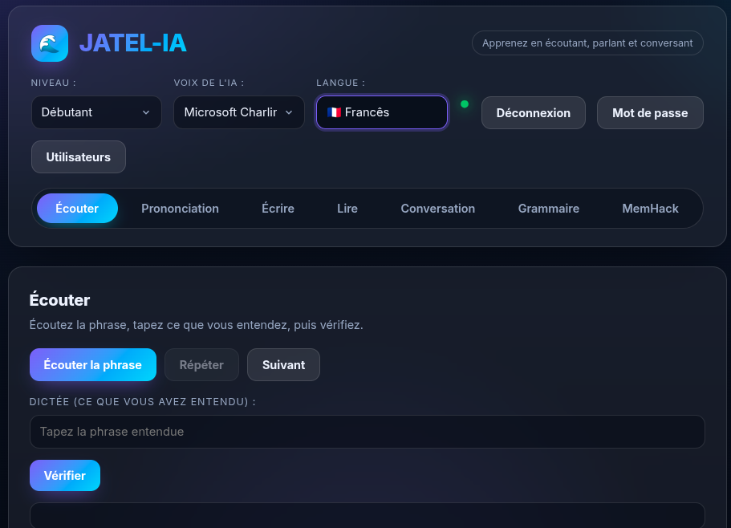

# JATEL-IA

### Multilingual AI-Powered Language Learning Platform

[](https://github.com/jeffersonsantos-sp/english-jatel/actions/workflows/ci.yaml)
[](https://github.com/jeffersonsantos-sp/english-jatel/actions/workflows/cd.yaml)
[](https://hub.docker.com/r/updateinformatica/english-jatel)
[](k8s/)
[](https://azure.microsoft.com/en-us/products/kubernetes-service)
[](https://english-jatel.onrender.com)
[](https://www.terraform.io)
[](https://python.org)
[](https://fastapi.tiangolo.com)
[](https://github.com/jeffersonsantos-sp/english-jatel/releases)

> Full-stack application that trains **English, Spanish, and French** across Listen, Pronunciation, Write, Read, Conversation (AI-powered), Grammar (CEFR A1–C2), and Spaced Repetition (MemHack) — with a complete **i18n UI** that translates the entire interface per language.

---

## Production URLs

A aplicacao esta rodando em **duas URLs simultaneamente**, cada uma com um proposito:

| URL | Provider | Uso |
|-----|----------|-----|
| **https://learn.jfs-devops.shop** | Azure AKS (Kubernetes) | Producao principal + demonstracao de DevOps |
| **https://english-jatel.onrender.com** | Render (PaaS) | Deploy automatizado no push ao `main` |

### Por que duas URLs?

| | Azure AKS (`learn.jfs-devops.shop`) | Render (`english-jatel.onrender.com`) |
|---|---|---|
| **Motivo** | Demonstracao completa de infraestrutura como codigo (Terraform + K8s + NGINX + TLS) | Deploy rapido e automatizado sem infraestrutura manual |
| **Provisionamento** | Terraform (IaC) | Gerenciado pelo Render |
| **Orquestramento** | Kubernetes (AKS) | Docker (gerenciado) |
| **TLS/HTTPS** | Let's Encrypt via cert-manager | Automatizado pelo Render |
| **DNS** | Azure DNS + Hostinger | Gerenciado pelo Render |
| **CI/CD** | GitHub Actions + `kubectl apply` | GitHub Actions + auto-deploy |
| **Custo** | ~$15/mes (AKS + DNS) | Free Tier (750h/mes) |
| **Escalabilidade** | Auto-scaling 1-2 nodes | Manual (plano gratuito) |
| **Blue/Green** | Sim (Kubernetes) | Nao |
| **Aprendizado** | Kubernetes, Terraform, Ingress, cert-manager | Deploy simples em PaaS |

### Resumo

- **Azure AKS**: Demonstracao de competencias DevOps — Terraform, Kubernetes, NGINX Ingress, Let's Encrypt, Blue/Green deployment, DNS management
- **Render**: Deploy pratico e automatico — a cada push no `main`, o Render faz build e deploy sem intervencao manual

---

## Screenshots

<table>
  <tr>
    <td align="center"><strong>English</strong></td>
    <td align="center"><strong>Espanol</strong></td>
    <td align="center"><strong>Francais</strong></td>
  </tr>
  <tr>
    <td></td>
    <td></td>
    <td></td>
  </tr>
</table>

---

## Cloud Architecture

### Azure AKS (Producao principal + DevOps demo)

```
                          ┌─────────────────────────────────────────────┐
                          │              INTERNET                       │
                          │  https://learn.jfs-devops.shop              │
                          └──────────────────┬──────────────────────────┘
                                             │
                          ┌──────────────────▼──────────────────────────┐
                          │         Azure DNS Zone                      │
                          │         jfs-devops.shop                     │
                          │         A learn -> 4.247.234.90             │
                          └──────────────────┬──────────────────────────┘
                                             │
                          ┌──────────────────▼──────────────────────────┐
                          │         Azure Public IP                     │
                          │         pip-ingress-english-jatel           │
                          │         4.247.234.90                        │
                          └──────────────────┬──────────────────────────┘
                                             │
 ┌───────────────────────────────────────────▼───────────────────────────┐
 │                    Azure AKS Cluster                                  │
 │                    aks-english-jatel                                  │
 │                    Kubernetes v1.35.6                                 │
 │                    Standard_B2als_v2 (2 vCPU, 4GB RAM)               │
 │                                                                      │
 │  ┌────────────────────────────────────────────────────────────────┐   │
 │  │  NGINX Ingress Controller (ingress-nginx namespace)           │   │
 │  │  LoadBalancer -> TLS termination (Let's Encrypt)              │   │
 │  └─────────────────────────────┬──────────────────────────────────┘   │
 │                                │                                      │
 │  ┌─────────────────────────────▼──────────────────────────────────┐   │
 │  │  cert-manager (cert-manager namespace)                        │   │
 │  │  ClusterIssuer: letsencrypt-prod                               │   │
 │  │  Auto-renewal: 90 days                                        │   │
 │  └─────────────────────────────┬──────────────────────────────────┘   │
 │                                │                                      │
 │  ┌─────────────────────────────▼──────────────────────────────────┐   │
 │  │  Service: english-jatel (ClusterIP: 10.0.28.149:80)           │   │
 │  │  Selector: app=english-jatel, slot=blue|green                 │   │
 │  └─────────────────────────────┬──────────────────────────────────┘   │
 │                                │                                      │
 │  ┌─────────────────────────────▼──────────────────────────────────┐   │
 │  │  Deployment: english-jatel-blue (active)                      │   │
 │  │  Image: updateinformatica/english-jatel:latest                 │   │
 │  │  Port: 8000                                                    │   │
 │  │  Security: runAsNonRoot, readOnlyRootFilesystem               │   │
 │  └─────────────────────────────┬──────────────────────────────────┘   │
 │                                │                                      │
 │  ┌─────────────────────────────▼──────────────────────────────────┐   │
 │  │  PVC: english-jatel-data (1Gi)                                │   │
 │  │  Mount: /app/data                                              │   │
 │  └────────────────────────────────────────────────────────────────┘   │
 │                                                                      │
 └──────────────────────────────────────────────────────────────────────┘
```

### Render (Deploy automatico)

```
                    ┌──────────────────────────────────────┐
                    │         INTERNET                     │
                    │  https://english-jatel.onrender.com  │
                    └──────────────┬───────────────────────┘
                                   │
                    ┌──────────────▼───────────────────────┐
                    │         Render PaaS                   │
                    │         (Free Tier, 750h/mes)        │
                    │                                       │
                    │  ┌─────────────────────────────────┐  │
                    │  │  Docker Container               │  │
                    │  │  Image: Docker Hub               │  │
                    │  │  Port: 8000                      │  │
                    │  │  TLS: Automatizado pelo Render   │  │
                    │  └─────────────────────────────────┘  │
                    │                                       │
                    └───────────────────────────────────────┘
```

---

## Azure Services

| Service | Resource | Purpose |
|---------|----------|---------|
| **AKS** | `aks-english-jatel` | Kubernetes cluster (Free Tier) |
| **Azure DNS** | `jfs-devops.shop` | Domain resolution |
| **Public IP** | `pip-ingress-english-jatel` | Static IP for Ingress |
| **Load Balancer** | Standard (managed by AKS) | Traffic distribution |
| **NGINX Ingress** | `ingress-nginx` namespace | Reverse proxy + TLS |
| **cert-manager** | `cert-manager` namespace | Certificate automation |
| **Let's Encrypt** | ACME HTTP-01 | Free TLS certificates |
| **Role Assignments** | Network + DNS Contributor | RBAC for AKS |

### Infrastructure as Code (Terraform)

| File | Resources |
|------|-----------|
| `terraform/main.tf` | AKS Cluster, DNS Zone, Public IP, Role Assignments |
| `terraform/variables.tf` | Region, VM size, domain configuration |
| `terraform/providers.tf` | Azure + Kubernetes + Helm providers |
| `terraform/outputs.tf` | AKS FQDN, DNS name servers, public IP |

### Terraform Commands

```bash
cd terraform
terraform init
terraform plan -out=tfplan
terraform apply tfplan

# Get credentials
az aks get-credentials --resource-group rg-english-jatel --name aks-english-jatel
```

### AKS Configuration

| Parameter | Value |
|-----------|-------|
| Region | `centralindia` |
| Kubernetes | `v1.35.6` |
| SKU Tier | `Free` |
| VM Size | `Standard_B2als_v2` |
| vCPU | 2 |
| RAM | 4GB |
| Auto-scaling | 1-2 nodes |
| Network Plugin | `kubenet` |
| Network Policy | `calico` |

---

## Highlights

| Capability | Details |
|-----------|---------|
| **3 Languages** | English, Spanish, French — full UI + content + TTS + STT |
| **7 Learning Modules** | Listen, Pronunciation, Write, Read, Conversation, Grammar, MemHack |
| **Full i18n** | Every label, button, tab, placeholder, and message translates when switching language |
| **AI Correction** | LLM-powered grammar/fluency correction via OpenRouter |
| **Neural TTS** | Edge TTS voices per language (zero cost, no API key) |
| **Speech-to-Text** | Web Speech API (browser) + backend fallback |
| **Spaced Repetition** | Leitner-style SRS with per-user progress persistence |
| **CEFR Grammar** | 46+ topics per language (A1–C2), data-driven, hot-reloadable |
| **Auth & Multi-user** | PBKDF2 passwords, admin roles, session cookies |
| **CI/CD** | GitHub Actions — CI on push, CD on git tag to Docker Hub |
| **Cloud Deploy** | Azure AKS with Terraform, NGINX Ingress, TLS |
| **Blue/Green** | Zero-downtime deployment on Kubernetes |

---

## Tech Stack

| Layer | Technology |
|-------|-----------|
| **Backend** | Python 3.11, FastAPI, Uvicorn |
| **Frontend** | Vanilla HTML/CSS/JS (SPA, no framework, no build) |
| **LLM** | OpenRouter (OpenAI-compatible API) |
| **TTS** | Edge TTS (neural voices, free) |
| **STT** | Web Speech API (browser) + SpeechRecognition fallback |
| **Auth** | HMAC-signed HttpOnly cookies, PBKDF2 passwords |
| **Database** | JSON files (users.json, memhack_progress.json) |
| **Container** | Docker multi-stage (python:3.11-slim) |
| **Orchestration** | Kubernetes (Kustomize, Blue/Green) |
| **Ingress** | NGINX Ingress Controller + cert-manager |
| **TLS** | Let's Encrypt (auto-renewed, 90 days) |
| **IaC** | Terraform (AKS, DNS, RBAC) |
| **CI/CD** | GitHub Actions |
| **Cloud** | Azure AKS (Central India), Render (PaaS) |

---

## Quick Start

### Option 1 — Local (Python)

```bash
cd backend
python3 -m venv .venv && source .venv/bin/activate
pip install -r requirements.txt
python3 -m uvicorn main:app --host 127.0.0.1 --port 8000
# Open http://localhost:8000
```

### Option 2 — Docker Compose

```bash
docker compose up -d --build
# Open http://localhost:8000
```

### Option 3 — Kubernetes

```bash
kubectl apply -k k8s/
kubectl -n english-jatel port-forward svc/english-jatel 8080:80
# Open http://localhost:8080
```

### Option 4 — Azure AKS (Producao + DevOps demo)

```bash
# 1. Provision infrastructure with Terraform
cd terraform
terraform init
terraform plan -out=tfplan
terraform apply tfplan

# 2. Configure kubectl
az aks get-credentials --resource-group rg-english-jatel --name aks-english-jatel

# 3. Install NGINX Ingress + cert-manager
helm repo add ingress-nginx https://kubernetes.github.io/ingress-nginx
helm repo add jetstack https://charts.jetstack.io
helm repo update
helm upgrade --install ingress-nginx ingress-nginx/ingress-nginx \
    --namespace ingress-nginx --create-namespace \
    --set controller.service.type=LoadBalancer \
    --set controller.service.externalTrafficPolicy=Local
helm upgrade --install cert-manager jetstack/cert-manager \
    --namespace cert-manager --create-namespace \
    --set installCRDs=true

# 4. Deploy application
kubectl apply -k k8s/

# 5. Configure DNS at registrar
# 6. Access: https://learn.jfs-devops.shop
```

### Option 5 — Render (Deploy automatico)

```bash
# 1. Conectar repositorio ao Render
# 2. Configurar Environment Variables:
#    - OPENROUTER_API_KEY
#    - OPENAI_MODEL
#    - OPENROUTER_TITLE
#    - SESSION_SECRET
#    - ADMIN_USER
#    - ADMIN_PASS
# 3. Deploy automatico a cada push no main
# 4. Acessar: https://english-jatel.onrender.com
```

---

## Modules

### Listen (Dictation)
AI speaks a sentence, you type what you heard, check for accuracy.

### Pronunciation (Speech)
Record your voice (or type), get transcript + AI correction, listen to corrected version.

### Write (Writing)
Write a paragraph, receive detailed correction: error, fix, rule, suggestion.

### Read (Comprehension)
Read a leveled text with glossary, answer a comprehension question, get corrected.

### Conversation (AI Chat)
Chat with an AI persona (Cafe, Interviewer, Business, Travel, Family, Movies, Music, Football, DevOps) in the selected language.

### Grammar (CEFR)
Lessons from A1 to C2: topic, structure formula, explanation, and example sentences with TTS. 46+ topics per language.

### MemHack (Spaced Repetition)
Memorize phrases with Leitner-style SRS (boxes 1-5, intervals from 1min to 7days).

---

## i18n — Full UI Internationalization

When switching language, every UI element translates:

| Element | EN | ES | FR |
|---------|----|----|-----|
| Tabs | Listen, Pronunciation, Write, Read, Conversation, Grammar, MemHack | Escuchar, Pronunciacion, Escribir, Leer, Conversar, Gramatica, MemHack | Ecouter, Prononciation, Ecrire, Lire, Conversation, Grammaire, MemHack |
| Buttons | Check, Record, Stop, Load | Comprobar, Grabar, Parar, Cargar | Verifier, Enregistrer, Arreter, Charger |

Implementation: `frontend/i18n.js` (translation dictionary) + `data-i18n` attributes in HTML.

---

## API Endpoints

| Method | Endpoint | Auth | Description |
|--------|----------|------|-------------|
| GET | `/api/health` | — | Status, LLM availability |
| GET | `/api/languages` | — | Supported languages |
| GET | `/api/levels` | — | Difficulty levels |
| GET | `/api/voices?lang=` | — | TTS voices per language |
| POST | `/api/content` | Yes | Get Listen/Read content |
| POST | `/api/correct` | Yes | AI text correction |
| POST | `/api/tts` | Yes | Text-to-speech (MP3) |
| POST | `/api/stt` | Yes | Speech-to-text |
| POST | `/api/converse` | Yes | AI conversation |
| POST | `/api/grammar` | Yes | Grammar topic |
| POST | `/api/memhack/next` | Yes | Next SRS phrase |
| POST | `/api/memhack/review` | Yes | Record difficulty |
| POST | `/api/auth/login` | — | Login |
| POST | `/api/auth/register` | Admin | Create user |

---

## CI/CD Pipeline

```
git push main --> CI (ci.yaml)
                   +-- backend: TestClient /api/health
                   +-- frontend: node --check

git tag vX.Y.Z --> CD (cd.yaml)
                   +-- build Docker image
                   +-- push -> Docker Hub (latest + vX.Y.Z)
                   +-- smoke test
```

---

## Deploy Options

| Platform | Method | URL | Status |
|----------|--------|-----|--------|
| **Azure AKS** | Terraform + K8s + NGINX + TLS | https://learn.jfs-devops.shop | Production (DevOps demo) |
| **Render** | Auto-deploy on push to `main` | https://english-jatel.onrender.com | Production (PaaS) |
| **Docker Hub** | `updateinformatica/english-jatel:latest` | — | Published |
| **Kubernetes** | Kustomize Blue/Green | — | Ready |
| **Local** | `docker compose up` or `uvicorn` | localhost:8000 | Ready |

---

## Security

- `.env` and `users.json` are gitignored — never committed
- API key injected at runtime via environment variable
- Passwords stored with PBKDF2 (per-user salt)
- Session cookies: HttpOnly + HMAC-signed
- HTTPS required in production (microphone + cookies)
- Admin-only routes: user management, grammar reload
- Kubernetes secrets — never commit `k8s/secret.yaml`
- TLS certificates auto-renewed by cert-manager

---

## Documentation

| Document | Description |
|----------|-------------|
| [Architecture](docs/technical/arquitetura.md) | Technical deep-dive |
| [Azure AKS Deploy](docs/technical/deploy-aks.md) | AKS + Terraform + NGINX + TLS |
| [Setup HTTPS](docs/technical/setup-https.md) | NGINX + Let's Encrypt guide |
| [Kubernetes Deploy](docs/technical/deploy-kubernetes.md) | k8s manifests + Blue/Green |
| [Blue/Green Strategy](docs/technical/blue-green.md) | Zero-downtime deployment |
| [Render Deploy](docs/technical/deploy-render.md) | PaaS deployment guide |
| [Setup HTTPS](docs/technical/setup-https.md) | NGINX + Let's Encrypt guide |
| [Versioning Process](docs/technical/processo-e-versionamento.md) | Release workflow |
| [MCP Integration](docs/technical/mcp.md) | AI agent tooling |

---

## Skills & Prompts

| Skill | Scope |
|-------|-------|
| [`english-jatel`](skills/english-flow/SKILL.md) | Full-stack app (modules, auth, content, CI/CD) |
| [`aks-deploy`](.opencode/skills/aks-deploy/SKILL.md) | Azure AKS deployment with Terraform |
| [`setup-https`](.opencode/setup-https/SKILL.md) | HTTPS/TLS with Let's Encrypt |
| [`mcp-integration`](.opencode/skills/mcp-integration/SKILL.md) | MCP server integration |

| Prompt | Purpose |
|--------|---------|
| [Deploy](prompts/english-jatel-deploy/prompt-base.md) | Docker + Kubernetes deployment |
| [AKS Deploy](prompts/english-jatel-deploy-aks/prompt-aks.md) | Azure AKS deployment |
| [Setup HTTPS](prompts/setup-https/prompt-setup-https.md) | HTTPS/TLS configuration |
| [Render Deploy](prompts/english-jatel-render/prompt-base.md) | Render PaaS deployment |
| [Brainstorm](prompts/brainstorm.md) | Feature ideation |

---

## Project Structure

```
english-jatel/
├── backend/
│   ├── main.py              # FastAPI app, routes, auth middleware
│   ├── engine.py            # All business logic (LLM, TTS, STT, content)
│   ├── grammar.json         # EN grammar (CEFR A1-C2)
│   ├── grammar_es.json      # ES grammar
│   ├── grammar_fr.json      # FR grammar
│   ├── memhack.json         # EN phrases (SRS)
│   ├── memhack_es.json      # ES phrases
│   ├── memhack_fr.json      # FR phrases
│   ├── listen_es.json       # ES dictation sentences
│   ├── listen_fr.json       # FR dictation sentences
│   ├── read_es.json         # ES reading texts
│   ├── read_fr.json         # FR reading texts
│   └── requirements.txt
├── frontend/
│   ├── index.html           # SPA main page
│   ├── login.html           # Login page
│   ├── style.css            # Dark theme UI
│   ├── app.js               # Client logic
│   ├── auth.js              # Authentication logic
│   └── i18n.js              # EN/ES/FR translation dictionary
├── terraform/               # Azure infrastructure (AKS, DNS, RBAC)
│   ├── providers.tf
│   ├── variables.tf
│   ├── main.tf
│   └── outputs.tf
├── k8s/                     # Kubernetes manifests (Blue/Green)
│   ├── deployment-blue.yaml
│   ├── deployment-green.yaml
│   ├── service.yaml
│   ├── ingress.yaml
│   ├── cluster-issuer.yaml
│   ├── configmap.yaml
│   ├── secret.yaml          # gitignored
│   └── kustomization.yaml
├── k8s/production/          # Production add-ons
│   ├── prometheus/
│   └── argocd/
├── .github/workflows/       # CI/CD pipelines
├── docs/                    # Technical + user documentation
├── prompts/                 # AI agent prompt templates
├── skills/                  # AI agent skills
├── Dockerfile               # Multi-stage build
├── docker-compose.yaml      # Local development
└── AGENTS.md                # Agent configuration
```

---

## Login

Default credentials are set in `backend/.env` (gitignored).

| User | Role |
|------|------|
| `admin` | Admin |
| `jatel` | Normal |
| `estudante` | Normal |

---

## Estimated Costs

| Platform | Resource | Monthly |
|----------|----------|---------|
| **Azure AKS** | AKS Free Tier | $0 |
| | Standard_B2als_v2 | ~$15 |
| | Azure DNS Zone | $0.50 |
| | Let's Encrypt + NGINX + cert-manager | $0 |
| **Render** | Free Tier (750h/mes) | $0 |
| **Total** | | **~$15.50** |

---

## Author

**Jefferson Santos** — DevOps

- GitHub: [jeffersonsantos-sp](https://github.com/jeffersonsantos-sp)
- Docker Hub: [updateinformatica](https://hub.docker.com/r/updateinformatica/english-jatel)

---

## License & Intellectual Property

**Private — All Rights Reserved**

© 2026 Jefferson Santos. Unauthorized copying, reproduction, distribution, or modification of this software, in whole or in part, is strictly prohibited.

This repository and its contents (source code, documentation, images, prompts, skills) are the intellectual property of the author.
